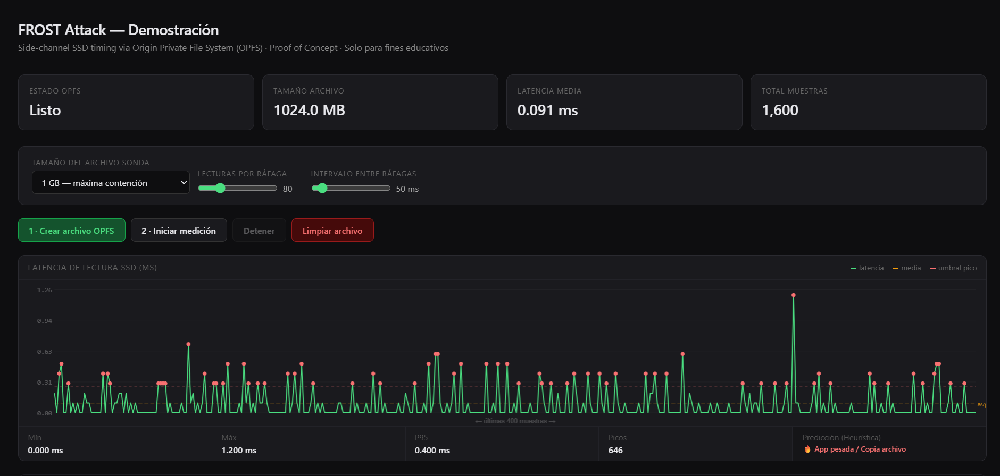

# FROST-PoC: OPFS SSD Timing Side-Channel Demo

> Disclaimer: Este proyecto es una Prueba de Concepto (PoC) creada estrictamente con fines educativos y de investigación. Demuestra la vulnerabilidad teórica de los ataques de canal lateral a través de sistemas de almacenamiento web. No incluye modelos de Machine Learning para desanonimizar tráfico o aplicaciones reales.
## Descripcion Breve
PoC educativo en JS que explota OPFS para medir la latencia SSD desde el navegador. Detecta picos de lectura I/O (contención), base de los ataques de canal lateral como FROST.
## Fundamento Tecnico
Este proyecto es una implementacion practica basada en investigaciones recientes de seguridad informatica (conocido como el ataque FROST). El concepto principal radica en que los discos de estado solido (SSD), a pesar de su extrema velocidad, poseen un ancho de banda finito y controladores de memoria que deben encolar y despachar las peticiones de entrada y salida (I/O). Cuando el sistema operativo o diferentes aplicaciones (por ejemplo, al abrir un programa pesado, iniciar un juego o desencriptar un archivo) envian rafagas masivas de lecturas y escrituras al SSD, se genera una contencion a nivel de hardware.
El estandar web moderno introdujo la API OPFS (Origin Private File System), que permite a las paginas web acceder al disco local del usuario con un rendimiento casi nativo. Esta caracteristica fue disenada para bases de datos pesadas en el navegador, pero abre una puerta a la observacion de micro-latencias. Esta prueba de concepto abusa de esta API para cronometrar, desde un entorno aislado en el navegador, cuanto tarda el disco en responder a lecturas constantes. Cuando la latencia se dispara temporalmente, el script deduce que el usuario acaba de iniciar otra aplicacion o proceso en su ordenador que esta consumiendo recursos del disco.
## Referencias y Noticias
Este PoC ilustra la vulnerabilidad documentada en los siguientes articulos y publicaciones de ciberseguridad:
- [Investigadores dicen que pueden espiar tu navegacion midiendo la actividad SSD a traves de una API del navegador (elHacker.net)](https://blog.elhacker.net/2026/05/investigadores-dicen-que-pueden-espiar.html)
- [Researchers say they can spy on your browsing by measuring SSD activity through a browser API (Tom's Hardware)](https://www.tomshardware.com/tech-industry/cyber-security/researchers-say-they-can-spy-on-your-browsing-by-measuring-ssd-activity-through-a-browser-api)
## Como funciona (Arquitectura Detallada del Ataque)
### 1. Infiltracion y Creacion del Archivo Sonda
El primer paso del script consiste en crear un archivo binario grande (por defecto, 256 MB) directamente en el disco duro del usuario empleando la API Origin Private File System. Esta operacion resulta especialmente critica desde el punto de vista de la privacidad porque es completamente silenciosa: no requiere permisos de administrador, no lanza avisos en el navegador (prompts) y no requiere que el usuario seleccione un directorio. 
### 2. Delegacion a un Web Worker Dedicado
El hilo principal del navegador en JavaScript (main thread) esta disenado para tareas asincronas y de interfaz de usuario. Sin embargo, para medir tiempos del orden de nanosegundos y milisegundos sin la interferencia del renderizado de la pagina, el proceso de lectura intensiva se delega a un hilo secundario (`worker.js`). Mover la logica a este hilo secundario permite el uso exclusivo del metodo `createSyncAccessHandle()`. Este metodo especial garantiza lecturas de disco de manera completamente sincrona, evitando el "event loop" tradicional de JavaScript y ofreciendo una precision temporal inaudita en aplicaciones web.
### 3. Bombardeo I/O y Medicion de Latencia
Una vez que el archivo sonda esta establecido y el Worker activo, el codigo inicia un bombardeo continuo y aleatorio. El worker realiza miles de operaciones de lectura de bloques pequenos (normalmente de 4 KB) dispersos a lo largo del archivo sonda. Para medir el tiempo exacto que tarda cada lectura en completarse, el script envuelve cada peticion I/O entre llamadas a `performance.now()`. La latencia base normal de un SSD M.2 moderno puede ser de fracciones de milisegundo.
### 4. Deteccion de Contencion de Hardware
El hilo principal recibe constantemente este torrente de datos temporales provenientes del Worker y los grafica en un lienzo. Cuando un proceso externo, como cargar el navegador Google Chrome o abrir la aplicacion de WhatsApp de escritorio, comienza a cargar sus librerias DLL, imagenes y bases de datos desde el disco a la RAM, el controlador del SSD se satura momentaneamente. El script observa como las latencias de lectura de sus pequenos bloques de 4 KB se disparan de forma subita, a veces multiplicando su tiempo de respuesta por 5 o por 10. La heuristica del script marca estos picos como eventos de actividad externa.
### El salto teorico a la desanonimizacion (Machine Learning)
En el ataque malicioso real completo (descrito en el paper de FROST), estas latencias no se analizan simplemente mostrando una alerta generica. Los atacantes graban estas secuencias de latencias y las transforman en representaciones matriciales de series temporales. 
Cada programa genera un patron de accesos a memoria distinto. Por ejemplo, un videojuego podria cargar archivos muy grandes secuencialmente, mientras que una aplicacion de mensajeria hace accesos fragmentados y pequenos. Estos patrones crudos se envian silenciosamente a un servidor externo, donde una Red Neuronal Convolucional (IA) preentrenada clasifica esos perfiles temporales. Al final, la IA es capaz de deducir el nombre exacto de la aplicacion que abrio el usuario, rompiendo la "sandbox" (caja de arena) del navegador y comprometiendo gravemente la privacidad local del sistema operativo.
## Requisitos y Uso
- Navegador moderno compatible con OPFS y Web Workers (Chrome 102+, Safari 15.2+, Firefox 111+).
- Disco duro SSD o NVMe (la deteccion de picos en discos duros mecanicos HDD puede presentar ruido no concluyente).
- Debe servirse a traves de contexto seguro: `localhost` o `HTTPS` valido (por estrictas politicas de seguridad del DOM para OPFS).
### Despliegue en Local
Para iniciar la prueba localmente, ejecuta un servidor HTTP basico en la raiz del directorio del proyecto.
Con Python:
```bash
python3 -m http.server 8000
```
Luego visita http://localhost:8000 en tu navegador web.
Con PHP:
```bash
php -S localhost:8000
```
Luego visita http://localhost:8000 en tu navegador web.
